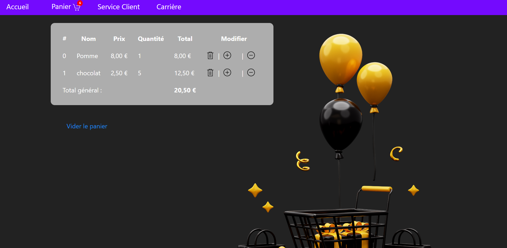
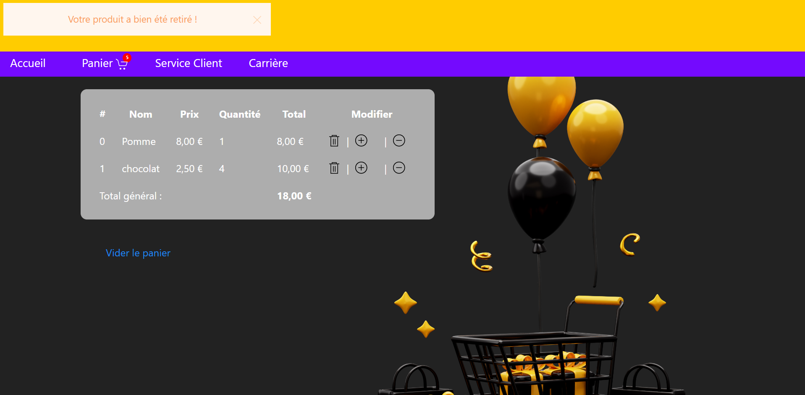
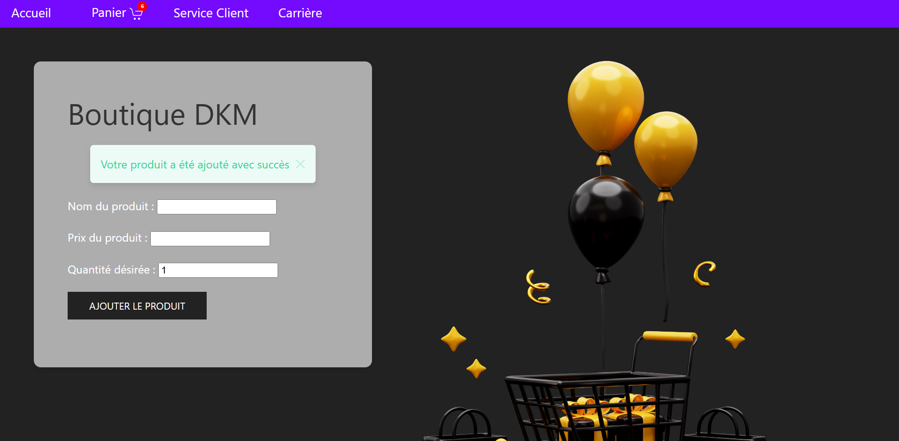

# 🛒 **Application de Gestion de Panier en PHP**

Bienvenue dans ce projet de **mini-application web** ! 🎉  
Ce projet met l'accent sur la gestion de produits et d'un panier en ligne à l'aide de **PHP** et des **sessions**, avec des **notifications conviviales** pour informer des actions réussies ou des erreurs.

---

## 🌟 **Focus du projet**

Ce projet se concentre exclusivement sur les fonctionnalités suivantes :

### 1. **Page d'accueil**
Permet :
- L'ajout de produits au panier avec un système de notification en cas de succès ou d'erreur.
  


### 2. **Page Panier**
Permet :
- La gestion des produits ajoutés (quantités, suppression, vidage complet).
  


### 3. **Notifications Utilisateur**
Des notifications pour confirmer les actions de l'utilisateur :
- **Retrait d'un produit**  
  
- **Ajout de produit**  
  

**Remarque :**  
Les onglets supplémentaires comme **Service Client** et **Carrière** sont des **pages fictives**, non développées dans cette version. L'objectif principal est de proposer un système fonctionnel et interactif basé sur un panier.

---

## 🛠️ **Technologies et outils**

- **PHP** : Gestion des données via sessions et manipulation côté serveur.
- **HTML / CSS** : Structure et personnalisation de l'apparence.
- **UIkit** : Framework pour les icônes et les notifications utilisateur.

---

## 🚀 **Mise en route**

### Pré-requis :
- Serveur local comme **XAMPP**, **Laragon**, ou **WAMP**.
- Une installation de **PHP** (version 7.4 ou plus).

### Installation :
1. **Cloner ou télécharger** le projet :
   ```bash
   git clone https://github.com/votre-utilisateur/votre-repo.git
