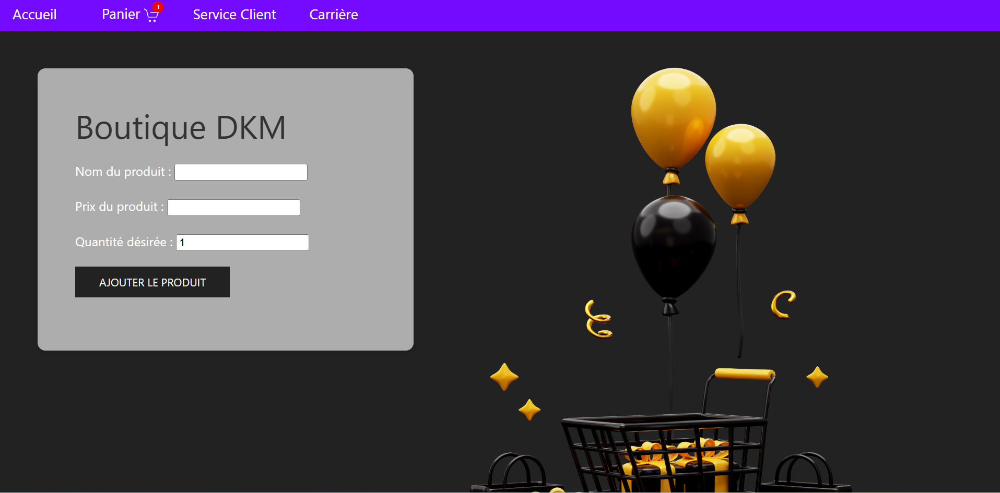

🛒 Application de Gestion de Panier en PHP
Bienvenue dans ce projet de mini-application web ! 🎉
Ce projet met l'accent sur la gestion de produits et d'un panier en ligne à l'aide de PHP et des sessions, avec des notifications conviviales pour informer des actions réussies ou des erreurs.

🌟 Focus du projet
Ce projet se concentre exclusivement sur les fonctionnalités suivantes :

Une page d'accueil permettant :
L'ajout de produits au panier avec un système de notification en cas de succès ou d'erreur.

Une page panier permettant :
La gestion des produits ajoutés (quantités, suppression, vidage complet).

Des notifications utilisateur pour confirmer :
Le retrait d’un produit.

L'ajout du produit

Les onglets supplémentaires comme Service Client et Carrière sont des pages fictives, non développées dans cette version.
L'objectif principal est de proposer un système fonctionnel et interactif basé sur un panier.

🛠️ Technologies et outils
PHP : Gestion des données via sessions et manipulation côté serveur.
HTML / CSS : Structure et personnalisation de l'apparence.
UIkit : Framework pour les icônes et les notifications utilisateur.
🚀 Mise en route
Pré-requis :
Serveur local comme XAMPP, Laragon, ou WAMP.
Une installation de PHP (version 7.4 ou plus).
Installation :
Cloner ou télécharger le projet :
bash
Copier le code
git clone https://github.com/votre-utilisateur/votre-repo.git
Placer les fichiers dans le répertoire de votre serveur local :
Exemple pour Laragon : C:\laragon\www\votre-projet.
Lancer le projet dans votre navigateur :
URL : http://localhost/votre-projet/index.php.
📂 Structure du projet
index.php : Page d'accueil pour ajouter des produits avec des notifications d'ajout.
recap.php : Résumé du panier avec gestion des produits et notifications de succès ou d'erreur pour :
Modification des quantités.
Suppression ou vidage complet des produits.
traitement.php : Fichier principal pour le traitement des actions liées au panier.
style.css : Feuille de style pour la mise en page.
🔔 Notifications utilisateur
Des notifications dynamiques sont affichées pour améliorer l'expérience utilisateur :

Succès d'ajout de produit : Une notification verte confirme l'ajout au panier.
Erreur d'ajout : Une notification rouge s'affiche en cas d'entrée invalide (ex. : prix ou quantité incorrecte).
Retrait de produit : Une notification verte confirme qu'un produit a bien été retiré.
Ces notifications sont gérées via UIkit et intégrées pour chaque action utilisateur.

🎯 Objectifs pédagogiques
Ce projet m'a permis de :

Maîtriser l'utilisation des sessions PHP pour gérer les données utilisateur.
Appliquer des fonctionnalités essentielles de CRUD (Create, Read, Update, Delete).
Mettre en œuvre des notifications utilisateur dynamiques pour améliorer l'interface.
Structurer un projet web tout en renforçant mes bases en développement backend.
🧱 Améliorations futures
Ajouter des pages fonctionnelles pour Service Client et Carrière.
Intégrer une base de données pour gérer les produits au lieu des sessions.
Améliorer l'interface avec un framework CSS comme Bootstrap ou TailwindCSS.
Ajouter des fonctionnalités avancées telles que des recommandations produits ou un système de paiement fictif.
📬 Contact
Pour toute suggestion ou question, n'hésitez pas à me contacter ! 💬